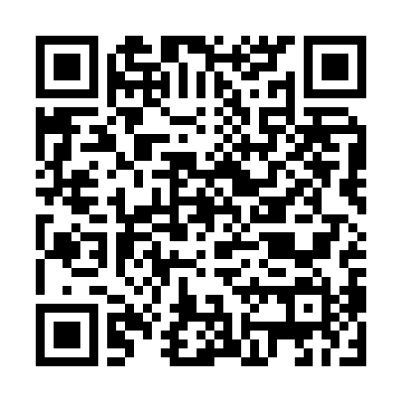
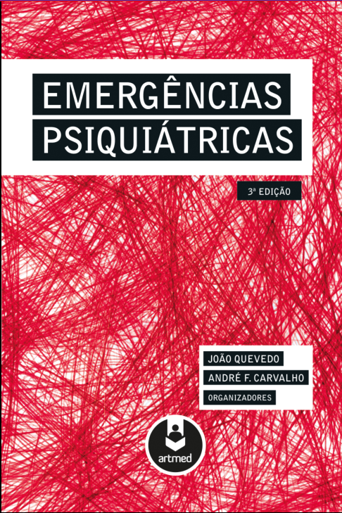
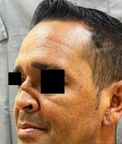
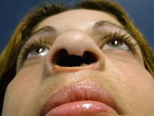

---
lang: pt-BR

# BEAMER VARIABLES {{{

# slideaspect ratio (43 for 4:3 [default], 169 1610 149 141 54 32
aspectratio: 43

# add extra beamer option with \setbeameroption{}
# beameroption: ''

# author affiliations: can be a list when there are multiple authors
institute: ATITUS Educação

# logo image for slides
# logo: path/to/logo

# (default is empty [no symbols] can be frame, # vertical, and horizontal)
navigation: ''

# enables “title pages” for new sections (default is true)
section‐titles: true

# beamer themes
# https://hartwork.org/beamer-theme-matrix/
# Theme Variables: theme, colortheme, fonttheme, innertheme, outertheme
# theme: Dresden
colortheme: beaver
# Theme option variables (each one is a list): themeoptions, colorthemeoptions,
# fontthemeoptions, innerthemeoptions, outerthemeoptions

# }}} BEAMER VARIABLES

# LATEX VARIABLES {{{

# The use of xelatex or lualatex as the PDF engine requires fontspec.
header-includes:
- \usepackage{fontspec}

# Using the fontspec package (requires xelatex or lualatex), you can use the
# name of any system font for these settings: mainfont, sansfont, monofont, mathfont
mainfont: "DejaVu Serif"

# In 'xelatex' and 'lualatex', you can pass options (the bits that go between
# the square brackets in a \setmainfont[]{} command) to your 'fontspec' fonts
# with: mainfontoptions, sansfontoptions, monofontoptions, mathfontoptions

# mainfontoptions:
# - Numbers=Lowercase
# - Numbers=Proportional

# If, while using lualatex, a glyph is not found in a main/sans/monofont, you
# can tell pandoc to try fonts from these lists: 
# mainfontfallback, sansfontfallback, monofontfallback

# mainfontfallback:
# - "FreeSans:"
# - "NotoColorEmoji:mode=harf"

toc: false
toc-depth: 2
toc-title: Índice

# }}} LATEX VARIABLES

# -=-=-=-=-=-=-=-=-=-=-=-=-=-=-=-=-=-=-=-=-=-=-=-=-=-=-=-=-=-=-=-=-=-=-=-=-=-=-

title: "Agitação Psicomotora"
subtitle: "Aspectos Gerais e Manejo"

author:
- Bruno Vinícius Fauth

date: 21/09/2025
...

## Preliminares

::: columns

:::: column

<!-- https://drive.google.com/file/d/1KIR9T7sACW7VMmpy5obzQR1nzDmgHxiq/view -->

::::

:::: column

::::

:::

# Introdução

## Importância

Comportamento agressivo e a agitação psicomotora são muito comuns em ambiente
de **urgência e emergência** e de internação hospitalar; e acontecem em
**pacientes psiquiátricos e não psiquiátricos**.

## Importância

Em pacientes **psiquiátricos**:

- Episódio agudo de mania

- Surto esquizofreniforme

- Transtornos de personalidade

## Importância

Em pacientes **não psiquiátricos**:

- AVC, demências, doença de Parkinson

- Delirium

- Abuso de álcool e drogas

## Definições Conceituais

**Agitação**: aumento da atividade cognitiva ou motora de maneira
desorganizada/improdutiva. Pode manifestar: inquietação, excitabilidade e, às
vezes, comportamento agressivo;

- Exemplo: paciente idoso confuso que grita e arranca a SVD

## Definições Conceituais

**Agressão**: ato realizado com intenção de causar dano físico ou mental.

- Exemplo: paciente idoso confuso que empurra o técnico que lhe está ajeitando.

## Definições Conceituais

**Violência**: agressão feita com a intenção de coagir alguém a fazer ou deixar
de fazer algo.

## Epidemiologia

**Prevalência na Emergência**:

- Agitação psicomotora, nos EUA, acarreta 1.7M idas à emergência por ano
    - 27% dos profissionais de saúde, em um estudo, relataram algum grau de
      insegurança física no trabalho

## Epidemiologia

**Incidência na População Idosa**:

- Ocorre em 13-24% dos idosos em amostras comunitárias.
    - Chega até 36% entre idosos institucionalizados com demrência

## Epidemiologia

**Prevalência na Internação**:

- Muito prevalente na UTI, ocorrendo em até 70% dos pacientes com TCE
    - Denota menor sobrevida se ocorre no contexto de delirium
    - Denota pior prognóstico de maneira geral: internação prolongada, maior
      taxa de infecções nosocomiais, maior taxa de extubações não desejadas

# Avaliação do Paciente Agitado

## Avaliação Inicial

### Observar o paciente

- Está só agitado? Agressivo? Representa risco?
    - avaliar necessidade de intervenção imediata.

## Avaliação Inicial

### Conversar com o paciente

- Coletar breve história e examinar o paciente
    - Exame do estado mental, exame físico e exame neurológico sumário.
    - Procurar por indícios de uso de SPAs, alterações do EEM, déficits neurológicos

## Avaliação Inicial

### Conversar com Terceiros (familiares, transporte, acompanhantes)

- Entender a perspectiva externa sobre o que está ocorrendo
    - Avaliar se a história do paciente é congruente com a realidade

## Avaliação Inicial

### Revisar Tratamentos Usados Previamente
- Ajuda a entender qual pode ser o quadro de base
- Hipóteses: esquizo sem tratamento? F72?

## Fatores de Risco para Comportamento Violento

### Sociodemográficos

- Sexo masculino

- Idade entre 15 e 24 anos

- Baixo nível socioeducacional

- Pobre rede de apoio

## Fatores de Risco para Comportamento Violento

### da História Prévia

- Histórico de comportamento violento

- Encarceramento prévio

- Abuso de substâncias psicoativas

## Fatores de Risco para Comportamento Violento

### do Quadro Clínico

- Alucinações de comando

- Mau controle de impulso (F60, F7x)

- Baixa adesão terapêutica

# Diagnósticos Diferenciais

## Principais Causas (lembrar dos 4 Ds):

- Drogas

- Delirium

- Demência

- Dano cerebral (TCE ou lesão parenquimatosa)

## Afastar Condições Clínicas que Justifiquem a Agitação

- Aqui entra a utilidade do exame neurológico feito antes

- Considerar rastreio infeccioso, neuroimagem e lab básico, conforme suspeita
    - Sinais focais? Alterações da marcha?

## Dados Ectoscópicos

| Observação                    | Hipótese Diagnóstica             |
|-------------------------------|----------------------------------|
| Dano ao septo nasal?          | cocaína                          |
| Hálito etílico ou cetônico?   | intoxicação alcoólica aguda, CAD |
| Dedos queimados?              | crack                            |
| Tosse e prejuízo ao sensório? | delirium (pneumonia)             |
| Alteração de marcha?          | causas neurológicas              |

## Dados Ectoscópicos

### Destruição do Septo Nasal no Uso de Cocaína

::: columns

:::: column

::::

:::: column

::::

:::

## Exame do Estado Mental

### **C-A-S-O-M-I A-Pe-Ju-Co-L**

- Alterações da primeira parte sugerem síndromes cerebrais orgânicas
    - Exemplo: DT, demências, encefalite, DHEL

- Alterações da segunda parte (principalmente afeto e pensamento) sugerem
  transtornos psiquiátricos, como esquizofrenia ou transtorno afetivo bipolar

## Exame do Estado Mental

### **C-A-S-O-M-I**

- Se as alterações penderem para o início do CASOMI, pensar em causas agudas
    - Exemplo: delirium, intoxicação exógena

- Se as alterações penderem para o fim do CASOMI, pensar em causas crônicas
    - Exemplo: demência de Alzheimer, demência de Parkinson

## Exame do Estado Mental

| Alteração           | Hipótese Diagnóstica   |
|---------------------|------------------------|
| Alucinação auditiva | Esquizofrenia, cocaína |
| Alucinação visual   | Drogas em geral        |
| Microzoopsias       | DT                     |
| Alucinações táteis  | DT                     |

# Manejo da Agitação Psicomotora

## Arsenal Terapêutico

- Medidas não coercivas → manejo ambiental e comportamental, desescalonamento verbal
    - Sempre devem ser priorizadas, pois não trazem as complicações das medidas coercivas

- Medidas coercivas → medicamentos intramusculares, contenção física
    - Cuidado com condutas baseadas em contratransferência ruim
    - Medicação IM pode causar hematoma
    - Contenção física pode causar lesão nervosa

## Medidas Não Coercivas

### Manejo Ambiental

- Sempre que possível, informar o paciente sobre as condutas
    - Trazer ele para tomar parte no manejo

- Equipe treinada

- Remoção de "armas em potencial"

- Porta aberta e acessível (ao médico e ao paciente)

- Redução dos estímulos externos
    - Barulho → ilusões, luz forte → ativação

## Medidas Não Coercivas

### Técnicas para Desescalonamento Verbal

- Não invadir o espaço do paciente

- Não ser provocativo, escutar ativamente

- Entender o que o paciente está pensando (motivo da agitação)

- Ser breve, conciso

- Ofertar escolhas em relação ao tratamento/manejo

- Estabelecer limites

O paciente tem de entender que você está ali para ajudar, e não é o inimigo dele.

## Medidas Coercivas

### Visão Geral

- Indicações:
    - falha às medidas não coercivas;
    - risco iminente de auto ou heteroagressão.

- Modalidades: 
    - reclusão → isolar o paciente;
    - contenção mecânica → amarrar os membros no leito.

## Medidas Coercivas

### Contenção Mecânica

- sem contenção química, é iatrogênico

- informar o paciente sobre o procedimento em curso

- posição: decúbito dorsal, com cabeceira algo elevada

- monitorar nível de consciência e SV

## Farmacoterapia

### Visão Geral

- Pode-se usar: antipsicóticos típicos e atípicos, benzodiazepínicos,
  anti-histamínicos

- Deve-se sempre preferir a via oral (menos invasivo, menor risco de
  complicações, maior arsenal terapêutico disponível).

- A avaliação diagnóstica inicial deve guiar a escolha farmacológica.

## Farmacoterapia

### Antipsicóticos Típicos

- Vantagens: rápida ação tranquilizante (neurolepsia), mesmo que o paciente
  persista com sintomas psicóticos.

- Haldol tem destaque porque é de alta potência → ação muito específica sobre
  D2, com poucos colaterais em outros receptores.
    - 5% de risco de distonia (reduz com associação de Prometazina)

## Farmacoterapia

### Antipsicóticos Típicos

- Haldol 10mg (2 amp) + Fenergan 50mg (1 amp) têm a mesma eficácia de 10mg de
  Olanzapina
    - Dose máxima diária de Haldol é 30mg (6 amp)
    - Dose máxima diária de Fenergan é 2 amp

## Farmacoterapia

### Antipsicóticos Típicos

- Clorpromazina IM também é eficaz, mas tem risco de hipotensão súbita e
  colaterais anticolinérgicos (pode piorar quadro de pacientes idosos com
  delirium ou demência).
    - Reduz limiar convulsivante

- Prometazina, mesmo não sendo antipsicótico, é fenotiazina → reduz limiar
    - Evitar uso em suspeita de DT.

## Farmacoterapia

### Antipsicóticos Atípicos

- Vantagens: menor risco de colaterais extrapiramidais

- Desvantagens: baixa disponibilidade nas emergências
    - Olanzapina é a 1ª linha nos EUA, mas, no Brasil, não tem Olanzapina IM!!

## Farmacoterapia

### Benzodiazepínicos

- Em geral seguros e eficazes
    - No São Pedro se usa bastante Haldol+Midazolam

- Risco de depressão respiratória em pacientes com ↓nível de consciência
    - Intoxicação alcoólica aguda, uso de depressores do SNC

- Mandatórios em caso de DT

## Farmacoterapia

### Benzodiazepínicos

| Fármaco   | Vias         | Vantagens               | Desvantagens             |
|-----------|--------------|-------------------------|--------------------------|
| Lorazepam | VO, EV ou IM | Excreção 100% renal     | Excreção 100% renal      |
| Midazolam | VO, EV ou IM | Rápido início de efeito | Efeito dura poucas horas |
| Diazepam  | VO ou EV     | Longa duração           | Não se usa por via IM    |

# Pós-manejo

- Firmar diagnóstico etiológico adequado

- Tratar a causa de base ou, se cabível, encaminhar a centro especializado

- Monitoramento contínuo

- Manejo farmacológico e ambiental para prevenir novos episódios

# Obrigado
